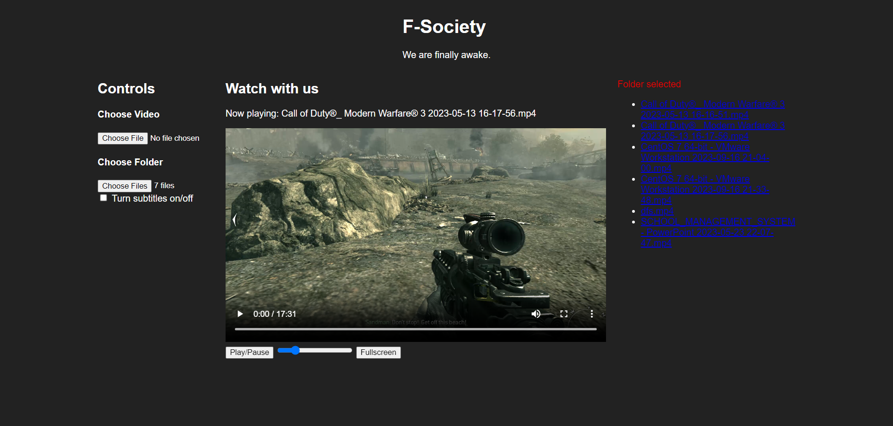

# F-Society Video Player

This project is a simple video player with a dark theme inspired by the F-Society from the TV show Mr. Robot. It allows you to select a video file or a folder of video files to play, and provides controls for play/pause, volume, and fullscreen.

## Features

- **Video Selection**: Choose a video file to play.
- **Folder Selection**: Choose a folder of video files to play.
- **Play/Pause**: Toggle between playing and pausing the video.
- **Volume Control**: Adjust the volume of the video.
- **Fullscreen**: Make the video go fullscreen.
- **Subtitles**: Turn subtitles on or off.

## Usage

To use the video player, simply open `index.html` in your web browser. Then, use the controls in the left sidebar to select a video file or a folder of video files to play.

## License

This project is licensed under the GNU GENERAL PUBLIC LICENSE.
